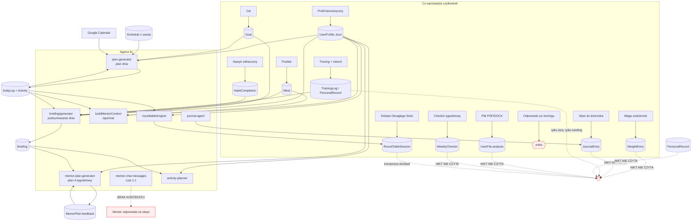

# Audyt 03 — Mapa mózgu (architektura danych i przepływu wiedzy)

Data: 2026-07-25
Zakres: `prisma/schema.prisma`, `src/app/api/**`, `src/lib/ai/**`, `src/lib/briefing/**`, `src/lib/roundtable/**`, `src/lib/files/**`, `src/lib/google/**`
Tryb: READ-ONLY. Nie zmieniono żadnego pliku aplikacji.
Podstawa liczb: 29 modeli w Prisma, 59 plików `route.ts` w `src/app/api`, 14 stron, 17 miejsc wywołania Claude (`anthropic.messages.create|stream`).

---

## Streszczenie

Aplikacja zbiera dużo danych o użytkowniku, ale agenci AI czytają tylko ich mały wycinek — reszta leży w bazie i nikt jej nie używa. Najmocniejszy przykład: rozmowa 1:1 z mentorem (zakładka Mentorzy) nie dostaje **żadnych** danych o użytkowniku — mentor odpowiada „na ślepo", tylko na podstawie swojego opisu postaci. Drugi przykład: gdy po treningu użytkownik odpowiada mentorowi „jak poszło", jego odpowiedź jest wysyłana do AI, odpowiedź AI jest **wyrzucana do kosza**, a tekst użytkownika nie zapisuje się nigdzie — czyli płacisz za zapytanie i tracisz dane. Kompletnie odcięte od AI są też: Dziennik AI, waga, rekordy życiowe, historia treningów przy planowaniu, analizy wgranych plików i wyniki Okrągłego Stołu. Rozwiązanie to jeden wspólny moduł kontekstu (`src/lib/ai/user-context.ts`), który zbiera pełny obraz użytkownika raz i wstrzykuje go do każdego wywołania AI, plus dwie nowe tabele, które zamieniają surowe dane w rosnącą wiedzę (wnioski tygodniowe i skuteczność planów).

---

## 1. Realna mapa zależności

### 1.1 Modele danych → kto pisze / kto czyta

Legenda kolumny „Czyta agent AI": **TAK** = trafia do promptu Claude, **NIE** = tylko UI/statystyki.

| Model (tabela) | Kto zapisuje (plik) | Kto czyta (API) | Czyta agent AI | Uwaga |
|---|---|---|---|---|
| `User` | `src/lib/auth/config.ts` | dashboard, admin | częściowo (imię) | `src/lib/briefing/generator.ts:83` |
| `UserProfile` (Json) | `src/app/api/admin/my-data/route.ts`, `admin/profile-settings/route.ts` | dashboard, meals, my-data | **TAK** (wszędzie jako surowy JSON) | `plan-generator.ts:193`, `mentor.ts:51-56` |
| `LifeArea` | seed / `admin/life-areas` | discipline, goals, mentors | **TAK** (tylko nazwy) | `plan-generator.ts:120-123` |
| `Mentor` | `admin/mentors` | mentors, goals, roundtable | **TAK** (systemPrompt) | rdzeń każdego agenta |
| `MentorConversation` + `MentorChatMessage` | `mentor-chat/conversations` | ta sama trasa | **TAK** (tylko 20 ost. wiadomości) | brak kontekstu użytkownika |
| `DailyLog` | `plan/generate`, `plan/replan`, `input/process`, `meals`, `mentor-plans/schedule-task` | dashboard, tracking, meals | **TAK** (7 dni) | `mentor.ts:26-36` |
| `Activity` | `plan/generate`, `cron/daily-plan`, `dashboard/init`, `input/process`, `schedule-task` | dashboard, meals, tracking | **TAK** | `plan-generator.ts:124-141` |
| `Meal` | `meals`, `activities/toggle`, `input/process` | diet, dashboard | **TAK** (7 dni w czacie, dziś w briefingu) | `mentor.ts:88-92` |
| `Habit` + `HabitCompletion` | `habits`, `habits/toggle`, `habits/import-notion` | habits, dashboard | **CZĘŚCIOWO** (tylko briefing) | `briefing/generator.ts:53-59` |
| `Goal` + `GoalMilestone` | `goals`, `goals/milestones` | goals, discipline, dashboard | **TAK** | `plan-generator.ts:89-98` |
| `MentorPlan` | `mentor-plan-generator.ts`, `toggle-task`, `task-feedback` | goals | **TAK** (feedback zadań) | `mentor-plan-generator.ts:190-210` |
| `TrainingLog` | `training-logs` | discipline, admin/my-data | **CZĘŚCIOWO** (tylko dzisiejsze, tylko briefing) | `briefing/generator.ts:60-67` |
| `PersonalRecord` | `personal-records` | discipline | **NIE** | sierota |
| `WeightEntry` | `weight` | weight (wykres) | **NIE** | sierota |
| `JournalEntry` | `journal` | journal | **NIE** | sierota |
| `JournalAgentConfig` | `journal/agent-config` | journal-agent | TAK (tylko własny prompt) | `journal-agent.ts:76-83` |
| `Briefing` | `briefing/generate`, `briefing/finalize` | dashboard, briefing/history | **CZĘŚCIOWO** (plany mentorów tak, plan dnia nie) | `mentor-plan-generator.ts:14` |
| `WeeklyCheckin` | `tracking/checkin` | tracking | **NIE** | sierota |
| `RoundTableSession` | `roundtable/engine.ts:382` | roundtable, admin | **NIE** | sierota (konsensus donikąd) |
| `UserFile` | `files/upload` | files, admin | **NIE** | sierota (analiza AI donikąd) |
| `Schedule` | **tylko `prisma/seed.ts:403`** | dashboard, plan-generator, cron | **TAK** | brak UI do edycji |
| `MeetingCompletion` | `calendar/meeting-toggle` | dashboard | **NIE** | — |
| `Feedback` | `admin/feedback`, `cron/feedback` | admin | **NIE** | — |
| `Account` (tokeny Google) | `auth/config`, `google/calendar` | calendar | pośrednio | `google/calendar.ts` |

### 1.2 Strona → API → agent AI

| Strona | Woła API | API woła agenta |
|---|---|---|
| `dashboard/page.tsx` | `/api/dashboard`, `/api/dashboard/init`, `/api/activities/toggle`, `/api/activities/generate-plan`, `/api/briefing/*`, `/api/habits*`, `/api/meals*`, `/api/input/process`, `/api/chat`, `/api/calendar/meeting-toggle` | `plan-generator`, `activity-planner`, `briefing`, `analyzer`, `meal-estimator`, `meal-vision`, `buildMentorContext` |
| `goals/page.tsx` | `/api/goals`, `/api/goals/generate-plan`, `/api/mentor-plans*`, `/api/mentors` | `mentor-plan-generator` (2 etapy) |
| `mentors/page.tsx` | `/api/mentors`, `/api/admin/mentors`, `/api/admin/life-areas`, `/api/mentor-chat/conversations` | czat 1:1 — **bez kontekstu** |
| `journal/page.tsx` | `/api/journal` | `journal-agent` (tylko redakcja) |
| `diet/page.tsx` | `/api/meals`, `/api/meals/recognize-image` | `meal-estimator`, `meal-vision` |
| `habits/page.tsx` | `/api/habits`, `/api/habits/stats`, `/api/habits/toggle` | brak AI |
| `roundtable/page.tsx` | `/api/roundtable`, `/api/roundtable/history`, `/api/mentors` | `roundtable/engine` |
| `discipline/[slug]/page.tsx` | `/api/discipline/[slug]`, `/api/training-logs`, `/api/personal-records` | **brak AI** |
| `tracking/page.tsx` | `/api/tracking/checkin`, `/api/tracking/stats` | brak AI |
| `admin/page.tsx` | `/api/admin/*`, `/api/files*`, `/api/calendar/*`, `/api/journal/agent-config`, `/api/voice/transcribe` | `files/analyzer`, `whisper` |

### 1.3 Diagram (mermaid)



---

## 2. Przepływy między sekcjami — co realnie działa

| # | Przepływ | Status | Dowód |
|---|---|---|---|
| 1 | aktywność ukończona → kalorie → dieta | **JEST** | `src/app/api/activities/toggle/route.ts:70-94` liczy `estimateCalories` i zapisuje do `metrics.caloriesBurned`; `src/app/api/meals/route.ts:61-70` sumuje je (`sumCaloriesBurned`), `:228-249` zwraca bilans |
| 2 | posiłek z planu dnia → rekord `Meal` | **JEST** | `src/app/api/activities/toggle/route.ts:119-282`: `detectMealType()` po nazwie aktywności + `estimateMacros(notes)`; toggle off kasuje posiłek (`:130-149`) |
| 3 | zadanie planu mentora → aktywność w dashboardzie | **JEST** | `src/app/api/mentor-plans/schedule-task/route.ts:81-92` tworzy `Activity` z notatką „Z planu mentora: …" |
| 4 | aktywność ukończona → postęp celu | **CZĘŚCIOWE (kruche)** | `src/app/api/activities/toggle/route.ts:288-389`: dopasowanie po `activity.notes.includes("Z planu mentora")` **i** `ts[i].title === activity.name`, synchronizacja tylko gdy `matches.length === 1` (`:327`) |
| 5 | dziennik AI → mentorzy go czytają | **BRAK** | `prisma.journalEntry` występuje wyłącznie w `src/app/api/journal/route.ts:49,99,129,134`. Żaden plik w `src/lib/ai/**` nie odwołuje się do `journalEntry` |
| 6 | briefingi → generowanie planu dnia | **BRAK** | `src/lib/ai/plan-generator.ts:1-4` — brak importu `loadRecentBriefings`; zapytania w `:84-142` nie obejmują `briefing`. Tak samo `src/app/api/cron/daily-plan/route.ts:42-68` |
| 7 | briefingi → plan 4-tygodniowy mentora | **JEST** | `src/lib/ai/mentor-plan-generator.ts:3` import, `:351` i `:458` `buildRecentBriefingsBlock(userId, 7)` |
| 8 | briefingi → plan konkretnego treningu | **JEST** | `src/lib/ai/activity-planner.ts:40-48` `loadRecentBriefings(userId, 3, 300)` |
| 9 | treningi (`TrainingLog`) → mentor przy planowaniu | **CZĘŚCIOWE** | Czyta je tylko `src/lib/briefing/generator.ts:60-67` i tylko z dzisiejszego dnia. `plan-generator.ts`, `mentor-plan-generator.ts`, `mentor.ts` nie mają zapytania o `trainingLog` |
| 10 | rekordy życiowe (`PersonalRecord`) → mentor | **BRAK** | `prisma.personalRecord` tylko w `src/app/api/personal-records/route.ts:23,52,77,82` i `src/app/api/discipline/[slug]/route.ts:52` |
| 11 | waga (`WeightEntry`) → kalorie / BMR | **BRAK** | `src/app/api/dashboard/route.ts:142-152` liczy BMR z `profile.data.weightKg`; `src/app/api/activities/toggle/route.ts:74-75` też z profilu. `prisma.weightEntry` występuje wyłącznie w `src/app/api/weight/route.ts` |
| 12 | profil biometryczny → agenci | **JEST, ale prymitywnie** | Wrzucany jako surowy `JSON.stringify` — `plan-generator.ts:193`, `mentor-plan-generator.ts:446`, `mentor.ts:51-56`, `roundtable/engine.ts:69-72`, `cron/daily-plan/route.ts:78` |
| 13 | Google Calendar → plan dnia | **JEST (za flagą)** | `src/lib/ai/plan-generator.ts:150-170` tylko gdy `profile.data.showCalendarInPlan === true`; blok „SPOTKANIE — zablokowane" `:218-223` |
| 14 | Google Calendar → dashboard | **JEST** | `src/app/api/dashboard/route.ts:154-181` + `MeetingCompletion` `:164-169` |
| 15 | Okrągły Stół → zmiana planu | **BRAK** | `RoundTableSession.planChanges` i `.applied` nigdy nie są zapisywane — pola występują wyłącznie w odczytach: `roundtable/history/route.ts:22-23`, `admin/roundtables/route.ts:22-23`, `roundtable/page.tsx:63-64,1085` |
| 16 | nawyki → plan dnia / mentorzy | **CZĘŚCIOWE** | Tylko `briefing/generator.ts:53-59`. `plan-generator.ts` nie widzi nawyków, więc planuje w oderwaniu od nich |
| 17 | analiza wgranych plików → agenci | **BRAK** | `files/analyzer.ts` zapisuje `UserFile.analysis`, ale `prisma.userFile` czytają tylko `files/route.ts:13`, `files/[id]/route.ts:20,58` i licznik w `admin/stats/route.ts:30` |
| 18 | checkin tygodniowy → agenci | **BRAK** | `prisma.weeklyCheckin` tylko w `tracking/checkin/route.ts:26,92`. Pole `mentorNotes` w schemacie (`schema.prisma:271`) nigdy nie jest zapisywane |
| 19 | czat 1:1 z mentorem → dane użytkownika | **BRAK** | `src/app/api/mentor-chat/conversations/[id]/messages/route.ts:54-59` — `system: conv.mentor.systemPrompt` i nic więcej. Tak samo pierwsza wiadomość: `conversations/route.ts:94-100` |
| 20 | historia treningów per dyscyplina → AI | **BRAK** | `src/app/api/discipline/[slug]/route.ts:46-97` zwraca dane wyłącznie do UI; strona `discipline/[slug]/page.tsx` nie woła żadnego endpointu AI |

---

## 3. Sieroty — dane, które użytkownik wprowadza, a nikt ich nie czyta

Kolejność: od największej straty.

1. **Odpowiedź użytkownika po treningu** — `src/app/(app)/dashboard/page.tsx:1600-1613`. Użytkownik dostaje pytanie od mentora (`activities/toggle/route.ts:109-115`: „Opowiedz mi jak poszło — czas, intensywność, samopoczucie?"), pisze odpowiedź, `fetch("/api/chat")` ją wysyła, a kod **ignoruje całą odpowiedź AI** i pokazuje tylko toast „Odpowiedz wyslana do mentora!". `src/app/api/chat/route.ts` nie zapisuje nic do bazy. Efekt: płatne wywołanie Claude bez żadnego artefaktu, a subiektywna ocena treningu (najcenniejsze dane treningowe) przepada.
2. **Dziennik AI** (`JournalEntry`) — do 100 wpisów, redagowanych i klasyfikowanych przez AI (`journal-agent.ts:69-125`), z tematami „zdrowie / dzieci / dziewczyna / biznes". Żaden mentor tego nie widzi.
3. **Waga** (`WeightEntry`) — mierzona codziennie, liczony trend 7-dniowy (`weight/route.ts:20-59`), a wszystkie kalorie i BMR liczone są z zamrożonego `profile.data.weightKg`. Użytkownik chudnie, a aplikacja liczy dalej po starej wadze.
4. **Rekordy życiowe** (`PersonalRecord`) — mentor układający plan treningowy nie wie, ile użytkownik podnosi ani jaki ma czas na dystansie.
5. **Historia treningów** (`TrainingLog`) — 30 ostatnich wpisów jest w API dyscypliny, ale AI widzi tylko dzisiejsze i tylko w briefingu.
6. **Analizy plików** (`UserFile.analysis`) — pełne `summary` + `extractedData` + `recommendations` z planu treningowego lub wyników badań (`files/analyzer.ts:32-99`) leżą w bazie nieużyte.
7. **Okrągły Stół** (`RoundTableSession.consensus`) — pełna debata mentorów i konsensus zapisane, ale ani plan dnia, ani plany mentorów ich nie czytają. Pola `applied` i `planChanges` są martwe.
8. **Checkin tygodniowy** (`WeeklyCheckin.wins` / `.fails` / `.areaStats`) — użytkownik pisze co poszło dobrze i źle, nikt tego nie czyta.
9. **`DailyLog.voiceTranscript`** — surowa notatka głosowa zapisywana (`input/process/route.ts:43,53`), czytana tylko przez… nikogo (agenci czytają energię/nastrój/sen, nie transkrypt).
10. **`DailyLog.protocolActivated`** — pole w schemacie (`schema.prisma:215`) nigdy nie zapisywane ani czytane.

Dodatkowo dwa błędy jakości danych, które psują nawet działające przepływy:

- `src/app/api/input/process/route.ts:58-67` tworzy aktywności z `type: "manual"` i `completed: true`. Typ `"manual"` nie istnieje w `METS_BY_TYPE` (`calorie-calculator.ts:7-46`) ani w `VALID_ACTIVITY_TYPES` (`plan-generator.ts:28-38`), a ponieważ aktywność powstaje od razu jako ukończona, `activities/toggle` nigdy nie policzy dla niej kalorii → aktywności zgłoszone głosem dodają **0 kcal** do bilansu diety.
- `src/app/api/mentor-plans/schedule-task/route.ts:84-87` twardo ustawia `type: "training"` dla każdego zadania z planu mentora. Zadanie „Przeczytaj rozdział o negocjacjach" dostanie MET 8 i doliczy ~400 kcal spalonych za godzinę „treningu".

---

## Znaleziska krytyczne (z dowodami plik:linia)

**K1. Czat 1:1 z mentorem nie zna użytkownika.**
`src/app/api/mentor-chat/conversations/[id]/messages/route.ts:54-59`:
```ts
const aiResp = await anthropic.messages.create({
  model: conv.mentor.model || "claude-sonnet-4-6",
  max_tokens: MAX_TOKENS,
  system: conv.mentor.systemPrompt,
  messages: aiMessages,
});
```
Brak profilu, celów, planów, treningów, wagi, nawyków. Istnieje gotowa funkcja `buildMentorContext` (`src/lib/ai/mentor.ts:12`), używana przez `/api/chat` (`src/app/api/chat/route.ts:33`), ale trasa czatu z historią jej nie używa. To jest główna przyczyna wrażenia „mentor nie pamięta, kim jestem".

**K2. Odpowiedź użytkownika po treningu jest wyrzucana.**
`src/app/(app)/dashboard/page.tsx:1603-1609` — `await fetch("/api/chat", …)` bez odczytu `response`; `src/app/api/chat/route.ts:44-60` tylko streamuje, nie zapisuje. Traci się i odpowiedź mentora, i tekst użytkownika.

**K3. Waga nie wpływa na nic poza własnym wykresem.**
`src/app/api/dashboard/route.ts:144` i `src/app/api/meals/route.ts:20` czytają `weightKg` z `UserProfile.data`. `prisma.weightEntry` nie występuje w żadnym pliku poza `src/app/api/weight/route.ts`. BMR/TDEE/kalorie spalone liczą się po nieaktualnej wadze.

**K4. Plan dnia nie zna historii.**
`src/lib/ai/plan-generator.ts:84-142` ładuje wyłącznie: profil, cele, mentorów, `Schedule`, obszary życia, dzisiejszy `DailyLog`. Nie ładuje: briefingów, nawyków, treningów, wagi, dziennika, poprzednich dni. Mentor planujący dzień nie wie, że wczoraj użytkownik zrobił 2/10 zadań ani że od tygodnia pomija poranną medytację.

**K5. Kontekst jest budowany 5 razy, w 5 różnych kształtach.**
`src/lib/ai/mentor.ts:47-100`, `src/lib/briefing/generator.ts:81-214`, `src/lib/roundtable/engine.ts:54-89`, `src/lib/ai/plan-generator.ts:192-285`, `src/app/api/cron/daily-plan/route.ts:73-123`. Każdy zna inny wycinek prawdy. Dodanie nowego pola (np. wagi) wymaga 5 edycji — i dlatego nigdy nie zostało zrobione.

**K6. Profil trafia do AI jako surowy `JSON.stringify`.**
`plan-generator.ts:193`, `mentor-plan-generator.ts:446`, `cron/daily-plan/route.ts:78`. Model dostaje `{"weightKg":88,"activityLevel":"moderate","showCalendarInPlan":true,...}` — łącznie z flagami technicznymi UI. Marnuje tokeny i myli model.

**K7. Synchronizacja zadanie ↔ aktywność ↔ cel opiera się na porównaniu tekstu.**
`src/app/api/activities/toggle/route.ts:288` (`notes.includes("Z planu mentora")`), `:313` (`ts[i].title === activity.name`), `:327` (`matches.length === 1`). Zmiana nazwy aktywności przez użytkownika albo dwa zadania o tym samym tytule w różnych planach = postęp celu przestaje się aktualizować, bez żadnego komunikatu.

**K8. `Schedule` (stały harmonogram) nie ma żadnego zapisu z aplikacji.**
Grep `prisma.schedule.(create|upsert|update)` w `src` — 0 trafień. Jedyne źródło: `prisma/seed.ts:403-471`. Harmonogram zasila plan dnia (`plan-generator.ts:110-119`), dashboard (`dashboard/route.ts:109`) i cron (`cron/daily-plan/route.ts:43`), a użytkownik nie może go zmienić w aplikacji.

**K9. Wynik Okrągłego Stołu nie zmienia niczego.**
`src/lib/roundtable/engine.ts:382-390` zapisuje `consensus` i `debateTranscript`, ale `applied`/`planChanges` nigdy nie są ustawiane, a UI wyświetla „⏳ Nie wdrożone" (`roundtable/page.tsx:1085`). Najdroższe wywołanie w aplikacji (2 rundy × N mentorów + Opus na syntezę) kończy się tekstem do przeczytania.

**K10. Aktywności z wpisu głosowego mają nieznany typ i zerowe kalorie.**
`src/app/api/input/process/route.ts:60-65` → `type: "manual"`, `completed: true`. `"manual"` nie ma MET-a (`calorie-calculator.ts:7-46`), a ukończona przy tworzeniu aktywność nie przechodzi przez `activities/toggle`, więc `metrics.caloriesBurned` pozostaje pusty.

---

## Rekomendacje

### P0 — blokujące „premium"

**P0-1. Jeden moduł kontekstu `src/lib/ai/user-context.ts` i wstrzyknięcie go do KAŻDEGO wywołania AI.**
Docelowo z modułu korzystają: `mentor-chat/conversations/route.ts`, `mentor-chat/conversations/[id]/messages/route.ts`, `chat/route.ts`, `plan-generator.ts`, `mentor-plan-generator.ts`, `briefing/generator.ts`, `roundtable/engine.ts`, `activity-planner.ts`. Szczegóły w sekcji „Gotowe do wdrożenia".

**P0-2. Czat 1:1 dostaje kontekst.** Najmniejsza zmiana o największym efekcie odczuwalnym: dwie linie w `messages/route.ts` i `conversations/route.ts`.

**P0-3. Zapisuj odpowiedź z FollowUpSheet.** Odpowiedź użytkownika po treningu powinna trafić do `MentorConversation` (jako wiadomość) **oraz** do `TrainingLog.notes` / `Activity.notes`. Dziś oba znikają.

**P0-4. Waga zasila kalorie.** Funkcja `getCurrentWeightKg(userId)`: najnowszy `WeightEntry` z ostatnich 14 dni, fallback do `profile.data.weightKg`, fallback 80. Podmiana w `dashboard/route.ts:144`, `meals/route.ts:20`, `activities/toggle/route.ts:75`.

### P1 — ważne

**P1-1. Dziennik do kontekstu mentorów** — 5 ostatnich wpisów `redactedText` (nie `rawText`) + rozkład tematów z 30 dni. Uwaga prywatnościowa: tematy „dzieci"/„dziewczyna" powinny trafiać tylko do mentorów przypisanych do odpowiednich `LifeArea` albo za zgodą użytkownika (flaga w profilu).
**P1-2. Rekordy i treningi do planowania** — przy planie dnia i planie mentora dołącz 5 ostatnich `TrainingLog` i wszystkie `PersonalRecord` z `lifeArea` powiązanego z celem.
**P1-3. Plan dnia widzi wczoraj** — dołącz 3 ostatnie briefingi (funkcja `loadRecentBriefings` już istnieje) + wskaźnik wykonania z 7 dni + streaki nawyków.
**P1-4. Nowa tabela `UserInsight`** — wnioski tygodniowe, żeby kontekst nie rósł liniowo z historią (patrz sekcja 5 poniżej).
**P1-5. Nowa tabela `PlanOutcome`** — mierzenie skuteczności planów: ile % zadań z planu mentora zostało zrobione, ile aktywności danego typu użytkownik odhacza, a ile pomija.
**P1-6. Naprawa typów aktywności** — `input/process` powinien mapować nazwę na typ z `VALID_ACTIVITY_TYPES` i liczyć kalorie od razu; `schedule-task` powinien wyprowadzać typ z `LifeArea.category` zamiast twardego `"training"`.
**P1-7. Stabilne ID zamiast dopasowania po tekście** — dodać `Activity.sourcePlanId` + `Activity.sourceTaskIndex` zamiast `notes.includes(...)`.

### P2 — dopieszczenie

**P2-1. Konsensus Okrągłego Stołu do kontekstu** — jedno zdanie „ostatnia decyzja zespołu mentorów: …" w bloku kontekstu; oraz przycisk „zastosuj w planie", który wypełnia `planChanges` i `applied`.
**P2-2. Analizy plików do kontekstu** — `UserFile.analysis.summary` z ostatnich 3 plików kategorii `training`/`diet`/`medical`.
**P2-3. Checkin tygodniowy (`wins`/`fails`) do kontekstu tygodniowego.**
**P2-4. UI do edycji `Schedule`** — dziś dane produkcyjne pochodzą z seeda.
**P2-5. Prompt caching** — blok stały kontekstu na końcu `system` z `cache_control: {type:"ephemeral"}`. Uwaga: minimalny cache'owalny prefiks dla `claude-sonnet-4-6` to **1024 tokeny**, a dla `claude-opus-4-6` i `claude-haiku-4-5` aż **4096** — poniżej tego progu cache po prostu nie powstaje, bez błędu. NIEZWERYFIKOWANE: czy `systemPrompt` mentora + blok stały przekracza próg — trzeba zmierzyć `messages.count_tokens` na realnym mentorze.

---

## Gotowe do wdrożenia

### A. Moduł mózgu — `src/lib/ai/user-context.ts`

Zasada: **jedna funkcja, jeden kształt, sekcje włączane zakresem**. Wszystkie zapytania równolegle (`Promise.all`), twardy limit znaków na sekcję, żeby prompt nie puchł.

```ts
// src/lib/ai/user-context.ts
import { prisma } from "@/lib/db/prisma";
import { subDays, startOfDay, format } from "date-fns";
import { pl } from "date-fns/locale";
import { calculateBMR, calculateTDEE, calculateTargetCalories } from "@/lib/ai/bmr-calculator";

export const USER_CONTEXT_VERSION = "ctx-v1";

/** Gdzie kontekst jest uzywany. Steruje tym, ktore sekcje sie wlaczaja. */
export type ContextScope =
  | "chat"        // rozmowa 1:1 z mentorem
  | "day-plan"    // generowanie planu dnia
  | "goal-plan"   // plan 4-tygodniowy do celu
  | "briefing"    // wieczorne podsumowanie
  | "debate";     // Okragly Stol

export interface UserContextOptions {
  scope: ContextScope;
  /** Zawez wyniki sportowe i cele do jednej dyscypliny (np. czat z trenerem karate). */
  lifeAreaId?: string | null;
  /** Twardy limit calego bloku (znaki). Domyslnie 6000 (~1700 tokenow PL). */
  maxChars?: number;
}

export interface UserContextResult {
  /** Blok, ktory wstrzykujemy do system promptu. */
  text: string;
  /** Czesc STALA — nadaje sie pod prompt caching (nie zmienia sie w ciagu dnia). */
  stableText: string;
  /** Czesc ZMIENNA — dzis, ostatnie 7 dni. */
  volatileText: string;
  version: string;
  builtAt: Date;
  sections: string[];
  approxTokens: number;
}

const SECTION_BUDGET = {
  tozsamosc: 700,
  stan: 500,
  cele: 900,
  rytm: 500,
  sport: 700,
  glowa: 700,
  ostatnieDni: 800,
  wnioski: 900,
  preferencje: 500,
} as const;

function cut(s: string, max: number): string {
  const t = s.trim();
  return t.length <= max ? t : t.slice(0, max - 3) + "...";
}

/** Aktualna waga: najnowszy pomiar z 14 dni, potem profil, potem 80 kg. */
export async function getCurrentWeightKg(userId: string): Promise<number> {
  const since = subDays(startOfDay(new Date()), 14);
  const latest = await prisma.weightEntry.findFirst({
    where: { userId, date: { gte: since } },
    orderBy: { date: "desc" },
    select: { weightKg: true },
  });
  if (latest?.weightKg) return latest.weightKg;
  const profile = await prisma.userProfile.findUnique({
    where: { userId },
    select: { data: true },
  });
  const d = profile?.data as { weightKg?: number } | undefined;
  return typeof d?.weightKg === "number" ? d.weightKg : 80;
}

export async function buildUserContext(
  userId: string,
  options: UserContextOptions
): Promise<UserContextResult> {
  const { scope, lifeAreaId = null, maxChars = 6000 } = options;
  const today = startOfDay(new Date());
  const d7 = subDays(today, 7);
  const d30 = subDays(today, 30);

  const wantsSport = scope === "chat" || scope === "day-plan" || scope === "goal-plan";
  const wantsGlowa = scope === "chat" || scope === "goal-plan" || scope === "debate";

  const [
    profile, user, weights, goals, plans, habits, habitDone,
    trainings, records, journal, briefings, insights, logs7,
  ] = await Promise.all([
    prisma.userProfile.findUnique({ where: { userId }, select: { data: true } }),
    prisma.user.findUnique({ where: { id: userId }, select: { name: true } }),
    prisma.weightEntry.findMany({
      where: { userId, date: { gte: d30 } },
      orderBy: { date: "desc" }, take: 30,
      select: { date: true, weightKg: true },
    }),
    prisma.goal.findMany({
      where: { userId, status: "active", ...(lifeAreaId ? { lifeAreaId } : {}) },
      orderBy: { createdAt: "desc" }, take: 6,
      select: { id: true, title: true, progress: true, targetDate: true, lifeAreaId: true },
    }),
    prisma.mentorPlan.findMany({
      where: { userId },
      orderBy: { weekNumber: "desc" }, take: 6,
      select: { weekNumber: true, tasks: true, mentor: { select: { name: true } } },
    }),
    prisma.habit.findMany({
      where: { userId, active: true },
      orderBy: { sortOrder: "asc" },
      select: { id: true, name: true },
    }),
    prisma.habitCompletion.findMany({
      where: { userId, date: { gte: d30 }, completed: true },
      select: { habitId: true, date: true },
    }),
    wantsSport
      ? prisma.trainingLog.findMany({
          where: { userId, ...(lifeAreaId ? { lifeAreaId } : {}) },
          orderBy: { date: "desc" }, take: 6,
          select: {
            date: true, exerciseName: true, sets: true, reps: true,
            weightKg: true, durationMin: true, distance: true, rating: true,
            lifeArea: { select: { name: true } },
          },
        })
      : Promise.resolve([]),
    wantsSport
      ? prisma.personalRecord.findMany({
          where: { userId, ...(lifeAreaId ? { lifeAreaId } : {}) },
          orderBy: { achievedAt: "desc" }, take: 8,
          select: { exerciseName: true, value: true, unit: true, achievedAt: true,
                    lifeArea: { select: { name: true } } },
        })
      : Promise.resolve([]),
    wantsGlowa
      ? prisma.journalEntry.findMany({
          where: { userId, createdAt: { gte: d30 } },
          orderBy: { createdAt: "desc" }, take: 5,
          select: { createdAt: true, redactedText: true, category: true, topic: true },
        })
      : Promise.resolve([]),
    prisma.briefing.findMany({
      where: { userId, date: { gte: d7 } },
      orderBy: { date: "desc" }, take: 3,
      select: { date: true, content: true },
    }),
    // NOWA TABELA — patrz sekcja B
    prisma.userInsight.findMany({
      where: { userId, active: true },
      orderBy: [{ weight: "desc" }, { createdAt: "desc" }], take: 8,
      select: { kind: true, text: true, periodLabel: true },
    }),
    prisma.dailyLog.findMany({
      where: { userId, date: { gte: d7 } },
      orderBy: { date: "desc" },
      select: {
        date: true, energy: true, mood: true, sleepHours: true, dayType: true,
        activities: { select: { name: true, completed: true, type: true } },
      },
    }),
  ]);

  const p = (profile?.data ?? {}) as Record<string, unknown>;
  const num = (v: unknown) => (typeof v === "number" ? v : null);
  const str = (v: unknown) => (typeof v === "string" && v.trim() ? v.trim() : null);

  const stable: string[] = [];
  const volatile: string[] = [];
  const used: string[] = [];

  // --- 1. TOZSAMOSC (stala) ---
  const wagaNow = weights[0]?.weightKg ?? num(p.weightKg) ?? 80;
  const bmr = calculateBMR({
    weightKg: wagaNow, heightCm: num(p.heightCm), age: num(p.age), gender: str(p.gender),
  });
  const tdee = calculateTDEE(bmr, str(p.activityLevel) ?? undefined);
  const cel = calculateTargetCalories(tdee, str(p.goal), num(p.weeklyTargetKg));
  const tozsamosc = [
    `Imie: ${user?.name?.split(" ")[0] ?? "Uzytkownik"}`,
    `Wiek: ${num(p.age) ?? "?"}, wzrost: ${num(p.heightCm) ?? "?"} cm, waga: ${wagaNow} kg`,
    `Cel sylwetkowy: ${str(p.goal) ?? "brak"} (${cel} kcal/dzien, BMR ${bmr}, TDEE ${tdee})`,
    str(p.medicalConditions) ? `Ograniczenia zdrowotne: ${str(p.medicalConditions)}` : "",
    str(p.injuries) ? `Kontuzje: ${str(p.injuries)}` : "",
    str(p.allergies) ? `Alergie: ${str(p.allergies)}` : "",
    str(p.trainingExperience) ? `Doswiadczenie: ${str(p.trainingExperience)}` : "",
  ].filter(Boolean).join("\n");
  stable.push(`## Kim jest\n${cut(tozsamosc, SECTION_BUDGET.tozsamosc)}`);
  used.push("tozsamosc");

  // --- 2. WNIOSKI DLUGOTERMINOWE (stale) ---
  if (insights.length > 0) {
    const t = insights.map((i) => `- [${i.kind}] ${i.text}${i.periodLabel ? ` (${i.periodLabel})` : ""}`).join("\n");
    stable.push(`## Co juz o nim wiemy\n${cut(t, SECTION_BUDGET.wnioski)}`);
    used.push("wnioski");
  }

  // --- 3. AKTUALNY STAN (zmienny) ---
  const trend =
    weights.length >= 8
      ? (weights.slice(0, 7).reduce((s, w) => s + w.weightKg, 0) / 7) -
        (weights.slice(7, 14).reduce((s, w) => s + w.weightKg, 0) / Math.max(weights.slice(7, 14).length, 1))
      : null;
  const dzis = logs7[0];
  const stan = [
    `Waga dzis: ${wagaNow} kg${trend !== null ? `, trend 7 dni: ${trend > 0 ? "+" : ""}${trend.toFixed(1)} kg` : ""}`,
    dzis?.energy != null ? `Energia dzis: ${dzis.energy}/10` : "",
    dzis?.mood ? `Nastroj: ${dzis.mood}` : "",
    dzis?.sleepHours != null ? `Sen: ${dzis.sleepHours}h` : "",
  ].filter(Boolean).join("\n");
  volatile.push(`## Stan na teraz\n${cut(stan, SECTION_BUDGET.stan)}`);
  used.push("stan");

  // --- 4. CELE I PLANY (zmienne) ---
  if (goals.length > 0) {
    const g = goals.map((x) =>
      `- ${x.title} — ${x.progress}%${x.targetDate ? `, termin ${x.targetDate.toISOString().slice(0, 10)}` : ""}`
    ).join("\n");
    const openTasks = plans.flatMap((pl) => {
      const ts = Array.isArray(pl.tasks) ? (pl.tasks as Array<{ title: string; done?: boolean }>) : [];
      return ts.filter((t) => !t.done).slice(0, 3).map((t) => `- [${pl.mentor.name}, tydz. ${pl.weekNumber}] ${t.title}`);
    }).slice(0, 8);
    volatile.push(
      `## Cele i otwarte zadania\n${cut(g + (openTasks.length ? `\nDo zrobienia:\n${openTasks.join("\n")}` : ""), SECTION_BUDGET.cele)}`
    );
    used.push("cele");
  }

  // --- 5. RYTM: nawyki (zmienny) ---
  if (habits.length > 0) {
    const byHabit = new Map<string, number>();
    for (const c of habitDone) byHabit.set(c.habitId, (byHabit.get(c.habitId) ?? 0) + 1);
    const r = habits.map((h) => `- ${h.name}: ${byHabit.get(h.id) ?? 0}/30 dni`).join("\n");
    volatile.push(`## Nawyki (30 dni)\n${cut(r, SECTION_BUDGET.rytm)}`);
    used.push("rytm");
  }

  // --- 6. WYNIKI SPORTOWE (zmienne) ---
  if (trainings.length > 0 || records.length > 0) {
    const tr = trainings.map((t) => {
      const parts = [t.exerciseName];
      if (t.sets) parts.push(`${t.sets}x${t.reps ?? "?"}`);
      if (t.weightKg) parts.push(`${t.weightKg}kg`);
      if (t.durationMin) parts.push(`${t.durationMin}min`);
      if (t.distance) parts.push(`${t.distance}km`);
      if (t.rating) parts.push(`ocena ${t.rating}/10`);
      return `- ${format(t.date, "d MMM", { locale: pl })}: ${parts.join(", ")}${t.lifeArea?.name ? ` [${t.lifeArea.name}]` : ""}`;
    }).join("\n");
    const rec = records.map((r) => `- REKORD ${r.exerciseName}: ${r.value} ${r.unit}`).join("\n");
    volatile.push(`## Forma i rekordy\n${cut([tr, rec].filter(Boolean).join("\n"), SECTION_BUDGET.sport)}`);
    used.push("sport");
  }

  // --- 7. GLOWA: dziennik (zmienny) ---
  if (journal.length > 0) {
    const j = journal.map((e) =>
      `- ${format(e.createdAt, "d MMM", { locale: pl })} [${e.category ?? "?"}/${e.topic ?? "?"}]: ${cut(e.redactedText ?? "", 180)}`
    ).join("\n");
    volatile.push(`## Co ma w glowie (dziennik)\n${cut(j, SECTION_BUDGET.glowa)}`);
    used.push("glowa");
  }

  // --- 8. OSTATNIE DNI (zmienne) ---
  if (logs7.length > 0) {
    const rows = logs7.map((l) => {
      const done = l.activities.filter((a) => a.completed).length;
      return `- ${format(l.date, "EEEE d MMM", { locale: pl })}: ${done}/${l.activities.length} zadan, energia ${l.energy ?? "?"}/10`;
    }).join("\n");
    const br = briefings.length
      ? "\nOstatnie podsumowania:\n" + briefings.map((b) => `[${b.date.toISOString().slice(0, 10)}] ${cut(b.content, 220)}`).join("\n")
      : "";
    volatile.push(`## Ostatnie 7 dni\n${cut(rows + br, SECTION_BUDGET.ostatnieDni)}`);
    used.push("ostatnieDni");
  }

  const stableText = stable.join("\n\n");
  const volatileText = volatile.join("\n\n");
  let text = `# KONTEKST UZYTKOWNIKA (${USER_CONTEXT_VERSION})\n\n${stableText}\n\n${volatileText}`;
  if (text.length > maxChars) text = text.slice(0, maxChars - 3) + "...";

  return {
    text,
    stableText,
    volatileText,
    version: USER_CONTEXT_VERSION,
    builtAt: new Date(),
    sections: used,
    approxTokens: Math.round(text.length / 3.5), // szacunek dla polskiego
  };
}
```

**Budżet tokenów (szacunek, do potwierdzenia `messages.count_tokens`):**

| Sekcja | Limit znaków | ~tokeny | Zakresy |
|---|---|---|---|
| Kim jest (stała) | 700 | ~200 | wszystkie |
| Co już wiemy (stała) | 900 | ~257 | wszystkie |
| Stan na teraz | 500 | ~143 | wszystkie |
| Cele i zadania | 900 | ~257 | wszystkie |
| Nawyki | 500 | ~143 | chat, day-plan, briefing |
| Forma i rekordy | 700 | ~200 | chat, day-plan, goal-plan |
| Dziennik | 700 | ~200 | chat, goal-plan, debate |
| Ostatnie 7 dni | 800 | ~229 | wszystkie |
| **Razem (max)** | **6000** | **~1700** | — |

Koszt: ~1700 tokenów wejścia na wywołanie. Przy `claude-sonnet-4-6` (3 USD / 1M tokenów wejścia) to ~0,005 USD za wywołanie. Przy 50 wywołaniach dziennie na użytkownika: ~0,25 USD/dzień. To akceptowalna cena za „mózg".

**Odświeżanie:** budowany na żądanie przy każdym wywołaniu AI (10 zapytań w jednym `Promise.all`, wszystkie po indeksach z `schema.prisma`). Bez cache'u w pamięci — dane muszą być świeże po każdym odhaczeniu zadania. Jeśli pomiar pokaże, że to za wolno, dodać cache 60 s per `(userId, scope)`.

**Wersjonowanie:** stała `USER_CONTEXT_VERSION` w nagłówku bloku. Gdy zmieni się kształt kontekstu, podbij na `ctx-v2` — dzięki temu w logach i zapisanych rozmowach widać, jaką wersją mózgu odpowiadał mentor.

**Wzrost z czasem:** sekcje „Ostatnie 7 dni" i „Dziennik" mają stały rozmiar niezależnie od stażu użytkownika. Rosnąca wiedza idzie do sekcji „Co już wiemy" (tabela `UserInsight`), która trzyma **skondensowane wnioski**, nie surowe dane. Po roku kontekst nadal ma ~1700 tokenów, ale niesie 8 najważniejszych wniosków z 52 tygodni.

### B. Dwie nowe tabele (do `prisma/schema.prisma`)

```prisma
/// Skondensowana wiedza o uzytkowniku. To jest "pamiec dlugoterminowa" mozgu.
model UserInsight {
  id          String   @id @default(cuid())
  userId      String   @map("user_id")
  /// "wzorzec" | "preferencja" | "ograniczenie" | "sukces" | "porazka"
  kind        String
  /// Jedno zdanie po polsku, np. "Trenuje najlepiej rano, wieczorne treningi pomija w 70%"
  text        String   @db.Text
  /// "tydzien 2026-W30" | "lipiec 2026" — skad wniosek
  periodLabel String?  @map("period_label")
  /// Skad pochodzi: "briefing" | "plan-outcome" | "task-feedback" | "journal"
  source      String
  /// 0-100, im wyzej tym wczesniej trafia do kontekstu
  weight      Int      @default(50)
  active      Boolean  @default(true)
  createdAt   DateTime @default(now()) @map("created_at")
  updatedAt   DateTime @updatedAt @map("updated_at")

  user User @relation(fields: [userId], references: [id], onDelete: Cascade)

  @@index([userId, active, weight])
  @@map("user_insights")
}

/// Skutecznosc planu — czy to, co mentor zaplanowal, zostalo zrobione.
model PlanOutcome {
  id           String   @id @default(cuid())
  userId       String   @map("user_id")
  mentorPlanId String?  @map("mentor_plan_id")
  goalId       String?  @map("goal_id")
  weekNumber   Int      @map("week_number")
  tasksTotal   Int      @map("tasks_total")
  tasksDone    Int      @map("tasks_done")
  /// Typy aktywnosci pomijane najczesciej, np. {"mindset":4,"study":2}
  skippedByType Json?   @map("skipped_by_type")
  /// Godziny, o ktorych zadania byly pomijane, np. ["06:00","21:30"]
  skippedAtTimes Json?  @map("skipped_at_times")
  createdAt    DateTime @default(now()) @map("created_at")

  user User @relation(fields: [userId], references: [id], onDelete: Cascade)

  @@index([userId, weekNumber])
  @@map("plan_outcomes")
}
```

Do modelu `User` dopisać relacje: `insights UserInsight[]` i `planOutcomes PlanOutcome[]`.

### C. Naprawa czatu 1:1 (minimalna zmiana, największy efekt)

W `src/app/api/mentor-chat/conversations/[id]/messages/route.ts`, zamiast `system: conv.mentor.systemPrompt` (linia 57):

```ts
import { buildUserContext } from "@/lib/ai/user-context";

const ctx = await buildUserContext(session.user.id, { scope: "chat" });

const aiResp = await anthropic.messages.create({
  model: conv.mentor.model || "claude-sonnet-4-6",
  max_tokens: MAX_TOKENS,
  system: [
    conv.mentor.systemPrompt,
    "",
    "---",
    "",
    ctx.text,
    "",
    "Odwoluj sie do KONKRETNYCH liczb i faktow z kontekstu. Nie wymyslaj danych, ktorych tam nie ma.",
  ].join("\n"),
  messages: aiMessages,
});
```

To samo w `src/app/api/mentor-chat/conversations/route.ts:94-100` (pierwsza wiadomość rozmowy).

### D. Aktualna waga w kaloriach (3 podmiany)

```ts
// src/app/api/activities/toggle/route.ts — zamiast linii 71-75
import { getCurrentWeightKg } from "@/lib/ai/user-context";
weight = await getCurrentWeightKg(session.user.id);
```
Analogicznie `src/app/api/dashboard/route.ts:144` i `src/app/api/meals/route.ts:20` (`extractBmrInput` → nadpisz `weightKg` wartością z `getCurrentWeightKg`).

### E. Co zapisywać, żeby wiedza ROSŁA

| Kiedy | Co policzyć / wyciągnąć | Gdzie zapisać |
|---|---|---|
| Codziennie po `briefing/finalize` (`src/app/api/briefing/finalize/route.ts:92`) | Poproś model o 1-2 zdania „trwałego wniosku" osobno od treści briefingu (osobne pole w JSON odpowiedzi) | `UserInsight` (`kind: "wzorzec"`, `source: "briefing"`) |
| Co niedzielę (nowy cron) | Z 7 briefingów + `PlanOutcome` z tygodnia → 3 wnioski tygodniowe; stare wnioski z tego samego obszaru oznacz `active: false` | `UserInsight` (`periodLabel: "tydzien 2026-W30"`) |
| Przy każdym `toggle-task` i `activities/toggle` | Zliczaj `tasksDone/tasksTotal`, typ pomijanych zadań, godzinę pomijanych aktywności | `PlanOutcome` |
| Przy `mentor-plans/task-feedback` (`route.ts:57`) | Feedback już jest w `MentorPlan.tasks[].feedback` i już wraca do generatora (`mentor-plan-generator.ts:190-210`) — dodatkowo przepisz go na `UserInsight` (`kind: "preferencja"`), żeby widzieli go WSZYSCY mentorzy, nie tylko autor planu | `UserInsight` |
| Przy zapisie wpisu do dziennika | Nic dodatkowego — wystarczy udostępnić `redactedText` w kontekście | — |
| Po debacie Okrągłego Stołu (`roundtable/engine.ts:382`) | Zapisz konsensus również jako `UserInsight` (`kind: "wzorzec"`, `weight: 80`) | `UserInsight` |
| Przy zmianie wagi > 1 kg / tydzień | Wniosek „deficyt dziala / nie dziala przy X kcal" | `UserInsight` (`kind: "wzorzec"`) |

Preferencje wywnioskowane z odrzuceń: jeżeli w `PlanOutcome.skippedByType` typ `mindset` ma ≥ 3 pominięcia w 2 tygodniach, zapisz `UserInsight`: „Zadania typu mindset pomija w 80% — proponowac krotsze formy albo inna pore dnia". To jest dokładnie ta pętla, która sprawia, że aplikacja „uczy się" użytkownika.

---

## Ryzyka

**R1. Prywatność dziennika.** Wpisy z tematami „dzieci" i „dziewczyna" trafią do promptu każdego mentora, jeśli sekcja „głowa" będzie włączona globalnie. Zabezpieczenie: włączać ją tylko dla `scope: "chat"` z mentorem przypisanym do pasującego `LifeArea`, albo dodać w profilu flagę `shareJournalWithMentors` (wzorem istniejącej `showCalendarInPlan`, `admin/profile-settings/route.ts:6`). Bez tego użytkownik może poczuć się „podsłuchany".

**R2. Koszt i czas odpowiedzi.** +1700 tokenów wejścia w każdym z 17 miejsc wywołania Claude. Największe ryzyko przy Okrągłym Stole — 2 rundy × N mentorów + Opus na syntezę: kontekst zostanie wysłany (2N+1) razy. Zalecenie: w `scope: "debate"` obniżyć `maxChars` do 3000 i przekazywać kontekst raz, w `baseQuestionBlock` (`roundtable/engine.ts:189-195`), tak jak dziś.

**R3. Zmiana wagi w kaloriach zmieni historyczne liczby.** Po podmianie źródła wagi bilans kaloryczny w kalendarzu diety pokaże inne wartości niż wczoraj (BMR liczony jest w locie, nie zapisany). Użytkownik może zgłosić to jako błąd. Zalecenie: zapisywać użytą wagę w `Activity.metrics.weightUsed` — to już się dzieje (`activities/toggle/route.ts:84`) — i docelowo liczyć historyczne dni z zapisanej wartości.

**R4. Nowe tabele wymagają migracji Prisma.** `UserInsight` i `PlanOutcome` to `prisma migrate dev` + deploy. Na produkcji trzeba to zrobić przed wdrożeniem kodu, który je czyta — `buildUserContext` woła `prisma.userInsight.findMany`, więc bez migracji **cała aplikacja AI przestanie działać**. Bezpieczne wdrożenie: najpierw migracja, potem kod. Albo w pierwszej wersji owinąć to zapytanie w `try/catch` zwracający `[]`.

**R5. Puste dane u nowego użytkownika.** Przy pierwszym uruchomieniu prawie wszystkie sekcje będą puste, a kontekst zredukuje się do 2-3 linijek. Model może wtedy zmyślać. Zabezpieczenie: gdy `sections.length < 3`, dopisać do bloku zdanie „To nowy uzytkownik — masz malo danych. Zadawaj pytania zamiast zakladac fakty."

**R6. Rozjazd wersji kontekstu a zapisane rozmowy.** `MentorChatMessage` przechowuje tylko treść, nie wersję kontekstu. Po zmianie `ctx-v1` → `ctx-v2` nie da się odtworzyć, czym mentor dysponował. Zalecenie: dopisać do `MentorChatMessage` pole `contextVersion String?`.

**R7. Modele są o generację w tyle.** Kod używa `claude-sonnet-4-6`, `claude-opus-4-6`, `claude-haiku-4-5-20251001` (`src/lib/ai/claude.ts:17-28`). Wszystkie trzy identyfikatory są poprawne i aktywne, ale istnieją już nowsze (`claude-opus-5`, `claude-sonnet-5`) o wyraźnie lepszym prowadzeniu długich rozmów. To nie blokuje mapy mózgu, ale warto zaplanować migrację osobno — nowsze modele mają zmiany łamiące (usunięte `temperature`, inne domyślne ustawienie „myślenia"), więc nie jest to podmiana samego stringa.

**R8. Prompt caching może po cichu nie zadziałać.** Jeśli blok stały + `systemPrompt` mentora nie przekroczy 1024 tokenów (`claude-sonnet-4-6`) albo 4096 (`claude-opus-4-6`, `claude-haiku-4-5`), cache nie powstanie i nie będzie żadnego błędu — tylko brak oszczędności. Weryfikacja: `usage.cache_read_input_tokens` musi być > 0 przy drugim wywołaniu.

---

NIEZWERYFIKOWANE: nie uruchamiałem aplikacji ani nie odpytywałem bazy — wszystkie ustalenia pochodzą z lektury kodu (`grep` + odczyt plików). Kod `user-context.ts` z sekcji „Gotowe do wdrożenia" nie był kompilowany ani uruchomiony; odwołuje się do modeli `userInsight`/`planOutcome`, które trzeba najpierw dodać do `schema.prisma` i zmigrować.

Ścieżka dokumentu: `C:\Users\Paweł Pieloch\CLAUDE CODE\Aplikacja Papi 2.0\papicoach\docs\audit\03-mapa-mozgu.md`
