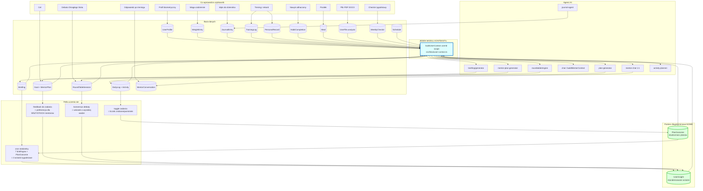

# BRAIN-SPEC: warstwa "mózgu" PAPI PLANER

Data: 2026-07-25
Podstawa: audyt `03-mapa-mozgu.md` + weryfikacja w realnym kodzie
Status: specyfikacja do wdrożenia. Ten dokument NIE zmienia żadnego pliku aplikacji.

---

## 0. Problem w jednym zdaniu

Aplikacja zbiera dużo danych o użytkowniku, ale agenci AI czytają tylko ich mały wycinek,
bo kontekst jest budowany **pięć razy, w pięciu różnych kształtach**, i nikt nie utrzymuje
wszystkich pięciu naraz.

Trzy dowody, sprawdzone w kodzie:

1. **Rozmowa 1:1 z mentorem nie dostaje żadnych danych o użytkowniku.** Odczytane w
   `src/app/api/mentor-chat/conversations/[id]/messages/route.ts`: wywołanie to
   `system: conv.mentor.systemPrompt` i nic więcej. Zero profilu, celów, treningów, wagi,
   nawyków. To jest źródło wrażenia "mentor nie pamięta, kim jestem".
2. **Odpowiedź po treningu jest wyrzucana.** `dashboard/page.tsx:1603-1609` wysyła tekst
   użytkownika do `/api/chat` i nie odczytuje odpowiedzi; `/api/chat/route.ts` nic nie zapisuje.
   Płatne wywołanie modelu, zero artefaktu, a subiektywna ocena treningu (najcenniejsze dane
   treningowe) przepada.
3. **Waga nie wpływa na nic poza własnym wykresem.** `prisma.weightEntry` występuje wyłącznie
   w `src/app/api/weight/route.ts`. Wszystkie kalorie i BMR liczą się z zamrożonego
   `profile.data.weightKg` (`dashboard/route.ts:144`, `meals/route.ts:20`,
   `activities/toggle/route.ts:75`). Użytkownik chudnie, a aplikacja liczy po starej wadze.

Potwierdzone: w `prisma/schema.prisma` jest 29 modeli (odczytana lista nazw), z czego
**8 to sieroty**: nikt ich nie czyta poza własnym ekranem.

---

## 1. Diagram: stan docelowy



Kluczowa różnica względem dziś: **wszystkie strzałki do agentów przechodzą przez jeden węzeł.**
Dziś każdy agent ma własne zapytania do bazy, dlatego dodanie wagi wymagałoby pięciu edycji
i nigdy nie zostało zrobione.

---

## 2. Moduł kontekstu użytkownika

Plik: `src/lib/ai/user-context.ts` (nowy)

### 2.1 Zasada

**Jedna funkcja, jeden kształt, sekcje włączane zakresem.** Wszystkie zapytania równolegle
(`Promise.all`), twardy limit znaków na sekcję, żeby prompt nie puchł wraz ze stażem użytkownika.

```ts
export type ContextScope =
  | "chat"       // rozmowa 1:1 z mentorem
  | "day-plan"   // generowanie planu dnia
  | "goal-plan"  // plan 4-tygodniowy do celu
  | "briefing"   // wieczorne podsumowanie
  | "debate";    // Okragly Stol

export interface UserContextOptions {
  scope: ContextScope;
  /** Zawez wyniki i cele do jednej dyscypliny, np. czat z trenerem karate. */
  lifeAreaId?: string | null;
  /** Twardy limit calego bloku w znakach. Domyslnie 6000. */
  maxChars?: number;
}

export interface UserContextResult {
  text: string;          // pelny blok do wstrzykniecia w system prompt
  stableText: string;    // czesc stala: nadaje sie pod prompt caching
  volatileText: string;  // czesc zmienna: dzis, ostatnie 7 dni
  version: string;       // "ctx-v1"
  builtAt: Date;
  sections: string[];    // ktore sekcje faktycznie sie wypelnily
  approxTokens: number;
}

export async function buildUserContext(
  userId: string,
  options: UserContextOptions
): Promise<UserContextResult>;

/** Aktualna waga: najnowszy pomiar z 14 dni, potem profil, potem 80 kg. */
export async function getCurrentWeightKg(userId: string): Promise<number>;
```

### 2.2 Sekcje i budżet tokenów

Podział na **stałe** (nie zmieniają się w ciągu dnia, kandydat pod prompt caching)
i **zmienne** (odświeżane przy każdym wywołaniu).

| # | Sekcja | Typ | Limit znaków | ~tokeny PL | Źródło | Zakresy |
|---|---|---|---|---|---|---|
| 1 | Kim jest | stała | 700 | ~200 | `UserProfile` + `User.name` + BMR/TDEE liczone z **aktualnej wagi** | wszystkie |
| 2 | Co już o nim wiemy | stała | 900 | ~257 | `UserInsight` (8 najwyżej ważonych) | wszystkie |
| 3 | Stan na teraz | zmienna | 500 | ~143 | `WeightEntry` (trend 7 dni) + dzisiejszy `DailyLog` | wszystkie |
| 4 | Cele i otwarte zadania | zmienna | 900 | ~257 | `Goal` + `MentorPlan.tasks` (nieukończone) | wszystkie |
| 5 | Nawyki (30 dni) | zmienna | 500 | ~143 | `Habit` + `HabitCompletion` | chat, day-plan, briefing |
| 6 | Forma i rekordy | zmienna | 700 | ~200 | `TrainingLog` (6 ostatnich) + `PersonalRecord` (8) | chat, day-plan, goal-plan |
| 7 | Co ma w głowie | zmienna | 700 | ~200 | `JournalEntry.redactedText` (5 ostatnich) | chat, goal-plan, debate, **za zgodą** |
| 8 | Ostatnie 7 dni | zmienna | 800 | ~229 | `DailyLog` + 3 ostatnie `Briefing` | wszystkie |
| | **Razem, maksimum** | | **6000** | **~1700** | | |

Przelicznik: dla polskiego ok. **3,5 znaku na token**. To szacunek, nie pomiar (patrz ryzyko R8).

**Koszt:** ok. 1700 tokenów wejścia na wywołanie. Przy `claude-sonnet-4-6` (3 USD za 1M tokenów
wejścia) to ok. 0,005 USD za wywołanie. Przy 50 wywołaniach dziennie: ok. 0,25 USD dziennie
na użytkownika. To akceptowalna cena za mózg.

**Wyjątek kosztowy: Okrągły Stół.** `roundtable/engine.ts` robi 2 rundy razy N mentorów plus
Opus na syntezę. Kontekst poszedłby tam (2N+1) razy. Dlatego `scope: "debate"` ma
`maxChars: 3000` i kontekst przekazywany **raz**, w bloku pytania bazowego
(`roundtable/engine.ts:189-195`), tak jak jest dziś z profilem.

### 2.3 Budowanie i odświeżanie

- **Kiedy:** na żądanie, przy każdym wywołaniu AI. Bez cache w pamięci.
- **Dlaczego bez cache:** dane muszą być świeże po każdym odhaczeniu zadania. Mentor, który mówi
  "widzę, że zrobiłeś 3 z 8" pięć minut po tym, jak użytkownik zrobił piąte, brzmi jak zepsuty.
- **Wydajność:** wszystkie zapytania w jednym `Promise.all` (10 zapytań), każde po indeksie
  z `schema.prisma`. Jeśli pomiar pokaże, że to za wolno, dodać cache 60 s per `(userId, scope)`
  z natychmiastowym unieważnieniem po `activities/toggle` i `habits/toggle`.
- **Puste dane:** gdy `sections.length < 3`, dopisać do bloku zdanie:
  `"To nowy uzytkownik, masz malo danych. Zadawaj pytania zamiast zakladac fakty."`
  Bez tego model przy pustej bazie zmyśla.

### 2.4 Wersjonowanie

- Stała `USER_CONTEXT_VERSION = "ctx-v1"` w nagłówku bloku tekstu.
- Zmiana kształtu kontekstu = podbicie na `ctx-v2`.
- Do modelu `MentorChatMessage` dopisać pole `contextVersion String?`. Bez tego, po zmianie
  wersji, nie da się odtworzyć, czym mentor dysponował, gdy odpowiadał.
- Do `Briefing` i `MentorPlan` warto dopisać to samo pole, żeby dało się porównać jakość
  planów generowanych różnymi wersjami mózgu.

### 2.5 Prywatność: sekcja "Co ma w głowie"

To jedyna sekcja z realnym ryzykiem. Dziennik zawiera tematy "dzieci", "dziewczyna", "zdrowie".
Wrzucenie ich do promptu każdego mentora może dać użytkownikowi poczucie bycia podsłuchiwanym.

Zabezpieczenie, oba warunki naraz:
1. Flaga w profilu `shareJournalWithMentors` (wzorem istniejącej `showCalendarInPlan`,
   `admin/profile-settings/route.ts:6`), domyślnie **wyłączona**.
2. Nawet po włączeniu: sekcja idzie tylko do `scope: "chat"` z mentorem przypisanym do
   pasującego `LifeArea`, oraz do `goal-plan` dla celu z tego obszaru.
3. Zawsze `redactedText`, nigdy `rawText`.

---

## 3. Brakujące połączenia, posortowane wg wartości dla użytkownika

Kolejność = ile użytkownik zyska na jednostkę pracy. Numer w nawiasie to priorytet z ROADMAP.

| # | Połączenie | Stan dziś (dowód) | Co zyskuje użytkownik | Praca |
|---|---|---|---|---|
| 1 | **Czat 1:1 dostaje kontekst** (P0) | `mentor-chat/conversations/[id]/messages/route.ts`: `system: conv.mentor.systemPrompt` i nic więcej. Ta sama luka w `conversations/route.ts:94-100` | Mentor przestaje odpowiadać na ślepo. To jest pojedyncza zmiana o największym efekcie odczuwalnym w całej aplikacji | 2 pliki, po ok. 8 linii |
| 2 | **Zapis odpowiedzi po treningu** (P0) | `dashboard:1603-1609` wysyła i ignoruje; `/api/chat` nic nie zapisuje | Subiektywna ocena treningu przestaje przepadać. Przestajemy płacić za wywołanie bez artefaktu | nowa trasa albo zapis w `/api/chat`, plus `TrainingLog.notes` |
| 3 | **Waga zasila kalorie** (P0) | `prisma.weightEntry` tylko w `weight/route.ts`; BMR liczony z `profile.data.weightKg` | Bilans kaloryczny przestaje kłamać po schudnięciu 5 kg | 1 funkcja + 3 podmiany: `dashboard/route.ts:144`, `meals/route.ts:20`, `activities/toggle/route.ts:75` |
| 4 | **Plan dnia widzi wczoraj** (P1) | `plan-generator.ts:84-142` nie ładuje briefingów, nawyków, treningów ani poprzednich dni | Mentor przestaje planować dzień w oderwaniu od tego, że wczoraj było 2/10 i od tygodnia pomijana jest medytacja | `loadRecentBriefings` **już istnieje** i jest używane w `activity-planner.ts:40-48` |
| 5 | **Treningi i rekordy do planowania** (P1) | `TrainingLog` czyta tylko `briefing/generator.ts:60-67`, i tylko z dzisiaj. `PersonalRecord`: zero odczytów przez AI | Mentor układający plan treningowy wie, ile użytkownik podnosi i jaki ma czas | sekcja 6 modułu kontekstu |
| 6 | **Naprawa typów aktywności** (P1) | `input/process/route.ts:60-65` tworzy `type: "manual"`, `completed: true`. `"manual"` nie ma MET-a w `calorie-calculator.ts:7-46`, a ukończona przy tworzeniu aktywność nie przechodzi przez `toggle` | Aktywności zgłoszone głosem przestają dodawać **0 kcal** do bilansu | mapowanie nazwy na `VALID_ACTIVITY_TYPES` + liczenie kalorii od razu |
| 7 | **Nawyki do planu dnia** (P1) | Nawyki czyta tylko `briefing/generator.ts:53-59` | Plan dnia przestaje kolidować z nawykami | sekcja 5 modułu |
| 8 | **Dziennik do mentorów** (P1, za zgodą) | `prisma.journalEntry` tylko w `journal/route.ts` | Mentor od głowy wie, co użytkownika gryzie | sekcja 7 + flaga zgody |
| 9 | **Stabilne ID zamiast dopasowania po tekście** (P1) | `activities/toggle/route.ts:288` (`notes.includes("Z planu mentora")`), `:313` (`ts[i].title === activity.name`), `:327` (`matches.length === 1`) | Postęp celu przestaje po cichu przestawać się aktualizować po zmianie nazwy zadania | `Activity.sourcePlanId` + `Activity.sourceTaskIndex`, migracja Prisma |
| 10 | **Typ zadania z planu mentora** (P1) | `mentor-plans/schedule-task/route.ts:84-87` twardo `type: "training"` | "Przeczytaj rozdział o negocjacjach" przestaje doliczać ok. 400 kcal za godzinę "treningu" | wyprowadzić typ z `LifeArea.category` |
| 11 | **Skuteczność planów: `PlanOutcome`** (P1) | brak tabeli | Aplikacja zaczyna wiedzieć, CZEGO użytkownik nie robi, a nie tylko co zaplanowano | nowa tabela + liczniki przy toggle |
| 12 | **Wnioski długoterminowe: `UserInsight`** (P1) | brak tabeli | Kontekst przestaje rosnąć liniowo z historią, a wiedza rośnie | nowa tabela + cron niedzielny |
| 13 | **Konsensus Okrągłego Stołu do kontekstu** (P2) | `roundtable/engine.ts:382-390` zapisuje `consensus`, ale `applied` i `planChanges` **nigdy nie są ustawiane**; UI pokazuje "Nie wdrożone" (`roundtable/page.tsx:1085`) | Najdroższe wywołanie w aplikacji przestaje kończyć się tekstem do przeczytania | jedno zdanie w kontekście + przycisk "zastosuj w planie" |
| 14 | **Analizy plików do kontekstu** (P2) | `files/analyzer.ts` zapisuje `UserFile.analysis`, czyta to tylko `files/route.ts:13` i licznik w `admin/stats` | Wyniki badań i plan treningowy z PDF wreszcie trafiają do mentora | `summary` z 3 ostatnich plików kategorii `training`/`diet`/`medical` |
| 15 | **Checkin tygodniowy do kontekstu** (P2) | `prisma.weeklyCheckin` tylko w `tracking/checkin/route.ts`. Pole `mentorNotes` (`schema.prisma:271`) nigdy nie zapisywane | To, co użytkownik sam nazwał sukcesem i porażką, trafia do mentorów | sekcja tygodniowa |
| 16 | **UI do edycji `Schedule`** (P2) | `prisma.schedule.(create\|upsert\|update)` = 0 trafień w `src`. Jedyne źródło: `prisma/seed.ts:403-471` | Użytkownik może zmienić swój stały harmonogram, który dziś zasila plan dnia, dashboard i cron | ekran w Ustawieniach |
| 17 | **`DailyLog.voiceTranscript` do kontekstu** (P2) | zapisywany (`input/process:43,53`), czytany przez nikogo | Surowa notatka głosowa przestaje być martwym polem | 1 linia w sekcji 3 |
| 18 | **Prompt caching** (P2) | brak | Oszczędność na powtarzanym bloku stałym | patrz ryzyko R7: progi cache |

Osobno do usunięcia lub wypełnienia: `DailyLog.protocolActivated` (`schema.prisma:215`)
nigdy nie jest ani zapisywane, ani czytane.

---

## 4. Mechanizm wzrostu wiedzy

### 4.1 Problem, który to rozwiązuje

Jeśli kontekst będzie zbierał surowe dane, po roku użytkowania będzie miał 52 tygodnie historii
i albo przekroczy budżet, albo trzeba będzie go ciąć, tracąc najstarsze (czyli często najważniejsze)
obserwacje. Rozwiązanie: **surowe dane mają stały rozmiar, a rośnie tylko warstwa wniosków.**

### 4.2 Dwie nowe tabele

```prisma
/// Skondensowana wiedza o uzytkowniku. To jest pamiec dlugoterminowa mozgu.
model UserInsight {
  id          String   @id @default(cuid())
  userId      String   @map("user_id")
  /// "wzorzec" | "preferencja" | "ograniczenie" | "sukces" | "porazka"
  kind        String
  /// Jedno zdanie po polsku, np. "Trenuje najlepiej rano, wieczorne treningi pomija w 70%"
  text        String   @db.Text
  /// "tydzien 2026-W30" | "lipiec 2026" - z jakiego okresu wniosek
  periodLabel String?  @map("period_label")
  /// "briefing" | "plan-outcome" | "task-feedback" | "journal" | "roundtable" | "weight"
  source      String
  /// 0-100, im wyzej tym wczesniej trafia do kontekstu
  weight      Int      @default(50)
  active      Boolean  @default(true)
  createdAt   DateTime @default(now()) @map("created_at")
  updatedAt   DateTime @updatedAt @map("updated_at")

  user User @relation(fields: [userId], references: [id], onDelete: Cascade)

  @@index([userId, active, weight])
  @@map("user_insights")
}

/// Skutecznosc planu: czy to, co mentor zaplanowal, zostalo zrobione.
model PlanOutcome {
  id             String   @id @default(cuid())
  userId         String   @map("user_id")
  mentorPlanId   String?  @map("mentor_plan_id")
  goalId         String?  @map("goal_id")
  weekNumber     Int      @map("week_number")
  tasksTotal     Int      @map("tasks_total")
  tasksDone      Int      @map("tasks_done")
  /// Typy pomijane najczesciej, np. {"mindset":4,"study":2}
  skippedByType  Json?    @map("skipped_by_type")
  /// Godziny, o ktorych zadania byly pomijane, np. ["06:00","21:30"]
  skippedAtTimes Json?    @map("skipped_at_times")
  createdAt      DateTime @default(now()) @map("created_at")

  user User @relation(fields: [userId], references: [id], onDelete: Cascade)

  @@index([userId, weekNumber])
  @@map("plan_outcomes")
}
```

Do modelu `User` dopisać relacje: `insights UserInsight[]` i `planOutcomes PlanOutcome[]`.

### 4.3 Co i kiedy podsumowywać

| Kiedy | Co policzyć lub wyciągnąć | Gdzie zapisać | Waga |
|---|---|---|---|
| Codziennie, po `briefing/finalize` (`briefing/finalize/route.ts:92`) | Poproś model o 1-2 zdania **trwałego wniosku**, osobno od treści briefingu (osobne pole w JSON odpowiedzi, nie doklejane do tekstu) | `UserInsight` `kind: "wzorzec"`, `source: "briefing"` | 40 |
| Przy każdym `activities/toggle` i `mentor-plans/toggle-task` | Licznik `tasksDone/tasksTotal`, typ pomijanych zadań, godzina pomijanych aktywności | `PlanOutcome` (upsert po `weekNumber`) | - |
| Przy `mentor-plans/task-feedback` (`route.ts:57`) | Feedback już wraca do generatora (`mentor-plan-generator.ts:190-210`), ale widzi go tylko autor planu. Przepisać go dodatkowo na wniosek | `UserInsight` `kind: "preferencja"` | 70 |
| Po debacie Okrągłego Stołu (`roundtable/engine.ts:382`) | Konsensus jako jeden wniosek | `UserInsight` `kind: "wzorzec"`, `source: "roundtable"` | 80 |
| Przy zmianie wagi większej niż 1 kg na tydzień | "Deficyt X kcal działa / nie działa" | `UserInsight` `kind: "wzorzec"`, `source: "weight"` | 60 |
| **Co niedzielę, nowy cron** | Z 7 briefingów + `PlanOutcome` z tygodnia zbuduj **3 wnioski tygodniowe**. Stare wnioski z tego samego obszaru oznacz `active: false` | `UserInsight` `periodLabel: "tydzien 2026-W30"` | 50-90 |

**Reguła wyprowadzona z odrzuceń (to jest pętla, dzięki której aplikacja "uczy się"):**
jeżeli w `PlanOutcome.skippedByType` typ `mindset` ma **3 lub więcej pominięć w ciągu 2 tygodni**,
zapisz `UserInsight`: `"Zadania typu mindset pomija w 80%. Proponowac krotsze formy albo inna pore dnia."`
Ten wniosek trafia do kontekstu **wszystkich** mentorów, więc następny plan wygląda inaczej.

### 4.4 Jak wersjonować wiedzę

1. **Wnioski nie są kasowane, tylko dezaktywowane** (`active: false`). Historia zostaje, do kontekstu
   idzie tylko aktywna czołówka.
2. **Cotygodniowa konsolidacja:** cron niedzielny, zanim doda 3 nowe wnioski, dezaktywuje stare
   z tego samego obszaru. Bez tego po roku będzie 150 wniosków, z których połowa jest nieaktualna.
3. **Limit twardy:** do kontekstu idzie 8 wniosków, sortowanie po `weight` malejąco, potem po
   `createdAt` malejąco. Po roku kontekst nadal ma ok. 1700 tokenów, ale niesie 8 najważniejszych
   obserwacji z 52 tygodni.
4. **Wersja mózgu w artefaktach:** `contextVersion` zapisywana przy każdej wiadomości mentora,
   briefingu i planie. Bez tego nie da się powiedzieć, dlaczego plan z maja był lepszy niż z lipca.

---

## 5. Kolejność wpięcia modułu

Trasy do przerobienia, w kolejności zysku:

| # | Plik | Zmiana |
|---|---|---|
| 1 | `src/app/api/mentor-chat/conversations/[id]/messages/route.ts` | `system: [mentor.systemPrompt, "---", ctx.text, "Odwoluj sie do KONKRETNYCH liczb z kontekstu. Nie wymyslaj danych, ktorych tam nie ma."].join("\n")` |
| 2 | `src/app/api/mentor-chat/conversations/route.ts` (ok. linii 94-100) | to samo dla pierwszej wiadomości rozmowy |
| 3 | `src/app/api/chat/route.ts` | zastąpić `buildMentorContext` modułem, scope `"chat"` |
| 4 | `src/lib/ai/plan-generator.ts` (blok zapytań 84-142, budowa promptu 192-285) | scope `"day-plan"` |
| 5 | `src/lib/ai/mentor-plan-generator.ts` (ok. 446) | scope `"goal-plan"` |
| 6 | `src/lib/briefing/generator.ts` (81-214) | scope `"briefing"` |
| 7 | `src/lib/roundtable/engine.ts` (54-89, blok pytania 189-195) | scope `"debate"`, `maxChars: 3000`, kontekst raz |
| 8 | `src/lib/ai/activity-planner.ts` | scope `"day-plan"`, `lifeAreaId` z aktywności |
| 9 | `src/app/api/cron/daily-plan/route.ts` (73-123) | scope `"day-plan"` |

Po wpięciu wszystkich dziewięciu **usunąć** dotychczasowe budowanie kontekstu z
`src/lib/ai/mentor.ts:47-100` i pozostałych czterech miejsc. Zostawienie ich obok modułu
odtwarza dokładnie ten problem, który naprawiamy.

Osobno: profil przestaje iść do modelu jako surowy `JSON.stringify`. Dziś model dostaje
`{"weightKg":88,"activityLevel":"moderate","showCalendarInPlan":true,...}`, czyli razem
z flagami technicznymi interfejsu (`plan-generator.ts:193`, `mentor-plan-generator.ts:446`,
`cron/daily-plan/route.ts:78`). Moduł formatuje profil na zdania po polsku.

---

## 6. Ryzyka

| # | Ryzyko | Skutek | Ograniczenie |
|---|---|---|---|
| R1 | **Migracja Prisma musi wyprzedzić kod** | `buildUserContext` woła `prisma.userInsight.findMany`. Bez migracji na produkcji **cała warstwa AI przestaje działać** | Kolejność: migracja, potem deploy kodu. Albo w pierwszej wersji owinąć to jedno zapytanie w `try/catch` zwracający `[]` |
| R2 | **Prywatność dziennika** | Tematy "dzieci" i "dziewczyna" w promptach wszystkich mentorów. Użytkownik może poczuć się podsłuchany | Flaga `shareJournalWithMentors` domyślnie wyłączona + dopasowanie po `LifeArea` + zawsze `redactedText` |
| R3 | **Koszt i czas odpowiedzi** | +1700 tokenów w każdym z 17 miejsc wywołania Claude. Największe ryzyko: Okrągły Stół wysyła kontekst (2N+1) razy | `maxChars: 3000` dla `debate` i przekazanie kontekstu raz, w bloku pytania bazowego |
| R4 | **Zmiana źródła wagi zmieni historyczne liczby** | BMR liczony jest w locie, nie zapisany. Bilans w kalendarzu diety pokaże inne wartości niż wczoraj. Użytkownik zgłosi to jako błąd | Waga użyta jest już zapisywana w `Activity.metrics.weightUsed` (`activities/toggle/route.ts:84`). Docelowo liczyć dni historyczne z tej zapisanej wartości |
| R5 | **Puste dane u nowego użytkownika** | Kontekst redukuje się do 2-3 linijek, model zmyśla | Zdanie ostrzegawcze przy `sections.length < 3` |
| R6 | **Rozjazd wersji kontekstu a zapisane rozmowy** | Po `ctx-v1` na `ctx-v2` nie da się odtworzyć, czym mentor dysponował | Pole `contextVersion` w `MentorChatMessage`, `Briefing`, `MentorPlan` |
| R7 | **Prompt caching może po cichu nie zadziałać** | Minimalny cache'owalny prefiks to **1024 tokeny** dla `claude-sonnet-4-6` i **4096** dla `claude-opus-4-6` oraz `claude-haiku-4-5`. Poniżej progu cache nie powstaje i **nie ma błędu**, tylko brak oszczędności | Weryfikacja: `usage.cache_read_input_tokens` musi być większe od 0 przy drugim wywołaniu |
| R8 | **Budżet tokenów jest szacunkiem** | Przelicznik 3,5 znaku na token dla polskiego to przybliżenie, nie pomiar | Zmierzyć `messages.count_tokens` na realnym profilu przed ustaleniem limitów na stałe |
| R9 | **Modele są o generację w tyle** | Kod używa `claude-sonnet-4-6`, `claude-opus-4-6`, `claude-haiku-4-5-20251001` (`src/lib/ai/claude.ts:17-28`). Wszystkie są aktywne, ale istnieją nowsze o lepszym prowadzeniu długich rozmów | Migracja modeli to **osobne zadanie**, nie doklejać do mózgu: nowsze modele mają zmiany łamiące, więc to nie jest podmiana jednego napisu |
| R10 | **Dodanie kontekstu zmieni ton odpowiedzi mentorów** | Mentor, który nagle zna wagę i rekordy, brzmi inaczej. Właściciel może uznać to za regres, jeśli lubił dotychczasowy styl | Wdrożyć najpierw na jednym mentorze, pokazać jedną rozmowę do akceptacji przed włączeniem wszędzie |

---

## 7. Czego nie zweryfikowałem

- Nie uruchamiałem aplikacji ani nie odpytywałem bazy. Wszystkie ustalenia pochodzą z odczytu kodu.
- Potwierdziłem osobiście: brak kontekstu w `mentor-chat/conversations/[id]/messages/route.ts`
  (odczytane wywołanie `anthropic.messages.create`) oraz listę 29 modeli w `prisma/schema.prisma`.
  Pozostałe odwołania plik:linia pochodzą z audytu 03.
- Kod modułu `user-context.ts` z audytu 03 nie był kompilowany ani uruchamiany. Odwołuje się do
  modeli `userInsight` i `planOutcome`, których w schemacie **jeszcze nie ma**.

**NIEZWERYFIKOWANE:** realny rozmiar kontekstu w tokenach i realny wpływ na czas odpowiedzi.
Wymaga pomiaru `messages.count_tokens` na koncie właściciela przed ustaleniem limitów.

---

Ścieżka dokumentu: `C:\Users\Paweł Pieloch\CLAUDE CODE\Aplikacja Papi 2.0\papicoach\docs\audit\BRAIN-SPEC.md`
